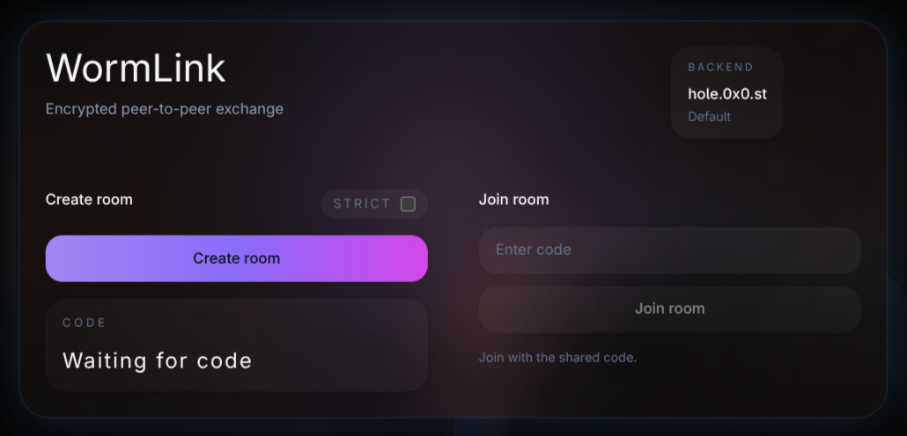

<h1 align="center">WormLink </h1>

> 🌀 WormLink is an encrypted P2P desktop application, compatible with WebWormhole servers, designed to reduce the trust required in remote servers.

<center></center>

---

## ✨ Features

- Encrypted peer-to-peer messaging  
- Encrypted file transfer (up to 512 MB)  
- Session code + QR sharing  
- Drag & drop file sending  
- Runtime backend selector (with validation)  
- Debug journal  
- Reduced motion support  

---

## 🔐 Security Notes

- Encryption is done locally before any transport  
- PAKE handshake (WebAssembly) for session setup  
- Signalling is encrypted after handshake  
- Session fingerprint is shown for manual verification  

### Strict mode (optional)

- Blocks messages and files until both peers verify the fingerprint  
- Blocks relay routes until a direct connection is available  
- Verification state is shared between both peers  

---

## 📦 File Transfer

- Chunked transfer (64 KiB)  
- SHA-256 integrity check per chunk  
- Manual save for received files (no auto-download)  
- Local preview for images and videos  

---

## 🌐 Backend

- Default: https://hole.0x0.st/  
- Custom endpoints supported  
- Endpoints are validated before use  
- HTTPS required (except localhost)  

---


## 🚀 Usage

To use this project, follow the steps below in your preferred terminal.

### 1️⃣ Installing Dependencies

Before anything else, install the necessary dependencies:

```shell
npm install
```

Note: This step is mandatory before building or running the application.

### 2️⃣ Run in Development

You can start the application in development mode with:

```shell
npm run dev
```

### 3️⃣ Build and Run

#### 🔹 Windows

1. Run the following command to build the Windows version:

```shell
npm run build-win
```

2. You can then launch the application from the generated output folder.

#### 🔹 MAC

1. Run the following command to build the macOS version:

```shell
npm run build-mac
```

2. Copy the application to `/Applications/` so that it appears in the Launchpad:

```shell
sudo cp -R WormLink.app /Applications/
```

3. You can then run `WormLink` directly from the Launchpad.

#### 🔹 Linux

1. Run the following command to build the Linux version:

```shell
npm run build-linux
```

2. You can then launch the generated application from the output folder.

---

## 👤 Author

Give a ⭐️ if this project helped you!

---

## 📝 License

Copyright © 2026 [Macxzew](https://github.com/Macxzew).<br />
This project is licensed under the MIT License.
